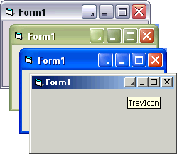



## TitleButton \(add new button to window caption\)

### Description

Add a new button to the window caption. Supports Windows XP theming.
 
### More Info
 

             |
---                |---
**Submitted On**   |2005-02-03 19:22:02
**By**             |[AB\-Software](https://github.com/Planet-Source-Code/PSCIndex/blob/master/ByAuthor/ab-software.md)
**Level**          |Advanced
**User Rating**    |4.0 (12 globes from 3 users)
**Compatibility**  |VB 6\.0
**Category**       |[Custom Controls/ Forms/  Menus](https://github.com/Planet-Source-Code/PSCIndex/blob/master/ByCategory/custom-controls-forms-menus__1-4.md)
**World**          |[Visual Basic](https://github.com/Planet-Source-Code/PSCIndex/blob/master/ByWorld/visual-basic.md)
**Archive File**   |[TitleButto184799232005\.zip](https://github.com/Planet-Source-Code/ab-software-titlebutton-add-new-button-to-window-caption__1-58679/archive/master.zip)

